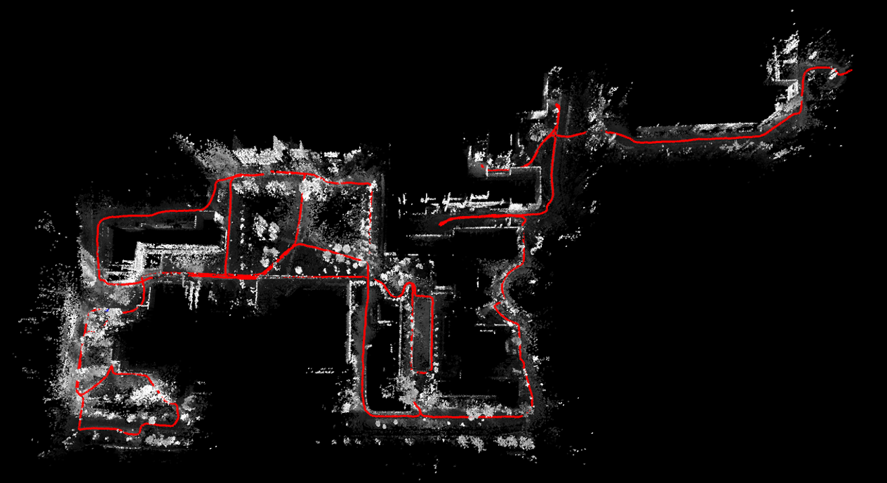

# Panoramic-LDSO

**Panoramic-LDSO** (Panoramic Direct LiDAR-assisted Visual Odometry) is designed for fully associating the 360-degree field-of-view (FOV) LiDAR points with the 360-degree FOV panoramic image datas. 360-degree FOV panoramic images can provide more available information, which can compensate inaccurate pose estimation caused by insufficient texture or motion blur from a single view.

## Related Work

[SDV-LOAM: Semi-Direct Visual-LiDAR Odometry and Mapping](https://ieeexplore.ieee.org/abstract/document/10086694)

Authors: [*Zikang Yuan*](https://scholar.google.com/citations?hl=zh-CN&user=acxdM9gAAAAJ), *Qingjie Wang*, *Ken Cheng*, *Tianyu Hao* and [*Xin Yang*](https://scholar.google.com/citations?user=lsz8OOYAAAAJ&hl=zh-CN)

## Demo Video (2024-09-14 Update)

The **x16 Real-Time Performance (Left)** and **Final Trjaectory and Sparse Map (Right)** on the segment of sequence *2012-01-08* from [*NCLT*](http://robots.engin.umich.edu/nclt/) dataset.

<div align="left">


</div>

## Installation

### 1. Requirements

> GCC >= 7.5.0
>
> Cmake >= 3.16.0
> 
> [Eigen3](http://eigen.tuxfamily.org/index.php?title=Main_Page) >= 3.3.4
>
> [OpenCV](https://github.com/opencv/opencv) >= 3.3
>
> [PCL](https://pointclouds.org/downloads/) == 1.8 for Ubuntu 18.04, and == 1.10 for Ubuntu 20.04
> 
> [Pangolin](https://github.com/stevenlovegrove/Pangolin) == 0.5 or 0.6 for Ubuntu 20.04

##### Have Tested On:

| OS    | GCC  | Cmake | Eigen3 | OpenCV | PCL | Pangolin |
|:-:|:-:|:-:|:-:|:-:|:-:|:-:|
| Ubuntu 20.04 | 9.4.0  | 3.16.3 | 3.3.7 | 4.2.0 | 1.10.0 | 0.5 |

### 2. Clone the directory and build

```bash
git clone https://github.com/ZikangYuan/panoramic_lidar_dso.git
mkdir build
cd build
cmake ..
make
```

## Run on Public Datasets

Noted: 

1. Before running, please down load the **calib** folder from **[Google drive](https://drive.google.com/drive/folders/1WnvzUzP_s70p4myPf5fsP1Jtr_62PnL1)**, and put it under the <PATH_OF_PROJECT_FOLDER>.

2. Currently the package only supports interfaces to *NCLT* and *IJRR* datasets. If you want to run on other datasets, you'll need to modify the code yourself.

###  1. Run on [*NCLT*](http://robots.engin.umich.edu/nclt/)

Before running, please ensure the dataset format is as follow:

```bash
<PATH_OF_NCLT_FOLDER>
	|____________2012-01-08
			  |____________lb3
			  |____________velodyne_sync
	|____________2012-09-28
			  |____________lb3
			  |____________velodyne_sync
	|____________2012-11-04
			  |____________lb3
			  |____________velodyne_sync
	|____________2012-12-01
			  |____________lb3
			  |____________velodyne_sync
	|____________2013-02-23
			  |____________lb3
			  |____________velodyne_sync
	|____________2013-04-05
			  |____________lb3
			  |____________velodyne_sync
```

Then open the terminal in the path of the <PATH_OF_PROJECT_FOLDER>/build, and type:

```bash
./dso_dataset dataset=<PATH_OF_NCLT_FOLDER> sequence=<SEQUENCE_NAME> seg=<SEGMENT_NUMBER> calib=<PATH_OF_PROJECT_FOLDER>/calib/nclt/calib undistort=<PATH_OF_PROJECT_FOLDER>/calib/nclt/U2D_Cam pathSensorPrameter<PATH_OF_PROJECT_FOLDER>/sensor/nclt/x_lb3_c resultPath=<PATH_OF_PROJECT_FOLDER>/output/pose.txt mode=1 quiet=0 IJRR=0
```

###  2. Run on [*IJRR*](https://robots.engin.umich.edu/SoftwareData/InfoFord)

Before running, please ensure the dataset format is as follow:

```bash
<PATH_OF_IJRR_FOLDER>
	|____________ford_1
			|____________Timestamp.log
			|____________IMAGES
			|____________pcd
	|____________ford_2
			|____________Timestamp.log
			|____________IMAGES
			|____________pcd
```

Then open the terminal in the path of the <PATH_OF_PROJECT_FOLDER>/build, and type:

```bash
./dso_dataset dataset=<PATH_OF_IJRR_FOLDER> sequence=<SEQUENCE_NAME> seg=<SEGMENT_NUMBER> calib=<PATH_OF_PROJECT_FOLDER>/calib/ijrr/calib undistort=<PATH_OF_PROJECT_FOLDER>/calib/ijrr/U2D_Cam pathSensorPrameter=<PATH_OF_PROJECT_FOLDER>/sensor/ijrr/x_lb3_c resultPath=<PATH_OF_PROJECT_FOLDER>/output/pose.txt mode=1 quiet=0 IJRR=1
```

## Citation

If you use our work in your research project, please consider citing:

```
@article{yuan2023sdv,
  author={Yuan, Zikang and Wang, Qingjie and Cheng, Ken and Hao, Tianyu and Yang, Xin},
  journal={IEEE Transactions on Pattern Analysis and Machine Intelligence}, 
  title={SDV-LOAM: Semi-Direct Visual–LiDAR Odometry and Mapping}, 
  year={2023},
  volume={45},
  number={9},
  pages={11203-11220},
}
```

## Acknowledgments

Thanks for [DSO](https://github.com/JakobEngel/dso).
